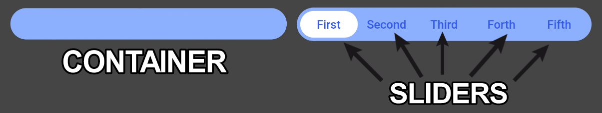

# Library for creating and customizing sliders

[Русский README.md](README.ru.md)

## Widget customization variations

Here are some examples of the library's features:


## First I suggest you get familiar with what container and sliders are in the library



The library lets you change the style of containers and sliders using the fields in the table below

## List and description of the functionality:

| Fields           | Description                                   |
| ---------------- |:---------------------------------------------:|
| slidersChild     | Widgets placed inside sliders / required |
| streamController | Controller responsible for getting the index information of the focused slider / required |
| containerHeight | Container height / required |
| containerWight | Container width / required |
| slidersColors | The color of each slider. A single color in the array will fill all sliders / white by default |
| slidersGradients | The gradient of each slider. A single gradient in the array will fill all sliders |
| containerBorder | Container frame widget |
| slidersBorder | Slider frame widget |
| containerBorderRadius | Container corner rounding radius |
| containerColor | Container fill color / grey by default |
| indents | Indents between the container and sliders (the same on all sides) / 0 by default |

## Creating your slider

First, you need to create a StreamController that will contain the index of the current slider.
It can be used to change screen elements depending on which slider is selected.

```
final StreamController<int> ctrl = StreamController<int>();
```

To make changes to screen elements work correctly, you need to wrap the necessary screen elements in StreamBuilder

```
StreamBuilder<int>(
   stream: ctrl.stream,
   initialData: 0,
    builder: (BuildContext context, AsyncSnapshot<int> snapshot) {
       return SlideSwitcher(
       slidersChild: [
         Text('First'),
         Text('Second'),
       ],
       streamController: ctrl,
       containerHeight: 40,
       containerWight: 350,
       );
    },
),
```

snapshot.data will store the index of the current slider.
You can see more details in the Example tab